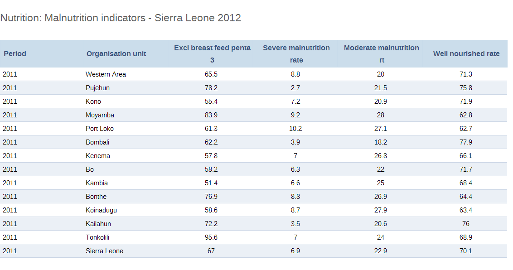

## What do we mean by integration?

* The combination of two pieces of software into a single system (at least from the user perspective)
* DHIS2 is written in Java, but R is a separate language. 
* Somethings are easy to do in Java, some things are easy to do in R. 
* Integration of this type can offer significant advantages, especially in terms of cost and risk mitigation.

---

## What is R?
* R is freely available, open source statistical computing environment.
* R refers to both the computer programming language, as well as the software which can be used to create and run R scripts.
* It is not possible to describe the breadth of what R can do in this lecture, but there are numerous resources available on the web.
* R is particularly well suited for (complex) statistical analysis and (advanced) visualization.
* Its interactive programming environment encourages ad-hoc programming, but fully supports object-oriented programming structures.
* [http://cran.r-project.org/](http://cran.r-project.org/) is the main site. 

---

## A simple example
```{r fig.width=5, fig.height=4}
# sample a normal distribution, with a mean of 5 and sd of 2, 100 times
x <- rnorm(100, mean=5, sd=2)
x.sorted <- sort(x)
# plot the expected and actual probability density
plot(x.sorted, dnorm(x.sorted, mean=5, sd=2), type='l',ylim=c(0,0.25), ylab='Probability', xlab='Value', main='Actual and expected distribution')
lines(density(x), col=1, lty=2)
```

This is just a trivial example of how to simulate data and plot it with R. 

---

## What just happened?
* We generated some random variates with `rnorm`
* We sorted them  with `sort`
* We plotted them with `plot`
* We added another layer to the plot with `lines`
* We can save this file to a script, and then run it as a script, or we can type it into the R environment line by line.
  
---

---

## Why would we want to use R with DHIS2?
* DHIS2 provides a powerful data collection, management and storage system.
* It can perform basic analysis, but lacks advanced analysis capabilities. 
* R is free and open source, and runs on multiple platforms (like DHIS2).
* R is a great compliment to DHIS2 to do things like
  * Statistical and epidemiological analysis
  * Plotting
  * Data transformation and importation
  * ...

---

## Example 1: Retrieving data with R and ODBC
```{r}
library(RODBC)
channel<-odbcConnect("dhis2")
sqlTest<-c("SELECT  name FROM dataelement ORDER BY name LIMIT 5;")
sqlQuery(channel,sqlTest)
``` 

All we did was connect to the DHIS2 database and retrieve some data element names. 

---

## Example 2: Analysis of ART data, by gender
* Suppose we have been asked to produce a plot of new ART acceptor by gender.
* We look in the database, and see the data element "ART new clients started on ARV"
* It appears to be disaggregated by age AND gender
* We can write a query and get some data (not displayed here)

```{r echo=FALSE, comment="", echo=FALSE}
sqlTest<-c("SELECT p.startdate, coc.categoryoptioncomboname,
 sum(dv.value::double precision)
 FROM datavalue dv
 INNER JOIN period p on dv.periodid = p.periodid
 INNER JOIN dataelement de on dv.dataelementid = de.dataelementid
 INNER JOIN _categoryoptioncomboname coc on dv.categoryoptioncomboid = coc.categoryoptioncomboid
 and de.name ~*('ART new clients started on ARV')
 GROUP BY categoryoptioncomboname, p.startdate
 ORDER BY p.startdate;")
arv<-sqlQuery(channel,sqlTest)
arv[1:5,]
```
* Problem is this data appears to be disaggregated by both age and gender. What should we do?

---

## Lets reaggregate the data by gender

```{r}
#Lets reaggregate the data by gender
#First, lets get rid of the age groups
arv$gender<-sapply(as.character(arv$categoryoptioncomboname), function(x) sub(")","",strsplit(x,",")[[1]][2]) )
#Reaggregate the data by gender
arv.sum<-aggregate(sum ~ gender, data = arv, sum)
#Format the numbers
arv.sum$Percentage<-round(arv.sum$sum/sum(arv.sum$sum)*  100, 2)
arv.sum
```
> We can obviously conclude from the data, that more women are new ARV entrants than men. 

---

## Why would we want to write a bunch of code to do this?
* Why not just do the analysis in Excel?
  * We could, but what if we need to do it again with new data?
* Why not use the _categorystructure table to get the right category options?
  * Might work, but what if we do not have the data in this format?


>Basically, R allows you to automate a particular analysis, so that you can write it once, and always reproduce it in the future.  
>The power to automate particular analyses is incredibly useful, time-saving, and allows you to show others what you have done.

---

## Example 3: Working with MyDatamart
* Suppose we have been asked to compare Antenatal coverage (1,2,3) by province in Sierra Leone over the last 12 months. 
* Suppose further we do not have direct access to the DHIS2 database server, but rather only through MyDatamart (which is quite likely)
```{r}
#First we need to load some libraries
library("DBI")
library("RSQLite")
library("lattice")
library("latticeExtra")
library("plyr")
```
Next, we need to connect to the database
```{r}
dbPath<-"C:\\dhis2\\sl.dmart"
drv<-dbDriver("SQLite")
db<-dbConnect(drv,dbPath)
```

---

## Example 3: Working with MyDatamart, continued

 We can define an SQL query to retrieve data from the MyDatamart database into an R data frame as follows.
```{r}
#An SQL query which will retreive all indicators 
#at OU2 le
sql<-"SELECT * FROM pivotsource_indicator_ou2_m 
WHERE year = '2011'"
#Execute the query into a new result set
rs<-dbSendQuery(db,sql)
#Put the entire result set into a new data frame
Inds<-fetch(rs,n=-1)
colnames(Inds)
```
```{r echo=FALSE, comment="", echo=FALSE}
#Clean up a bit
foo <- dbClearResult(rs)
foo <- dbDisconnect(db)
```

---

## Example 3: Working with MyDatamart, continued
* Looks like we have a lot of columns and indicators, but only a few which we are really interested in. 
* Looks like we have a lot of indicators, only a few of which we are really interested in. 
* We see from the colnames command that there is an column called "indshort" which looks like it contains some indicator names.
* After we have determined which ones we need (ANC 1, 2, and 3), lets further subset the data so that we only have these.

---

## Example 3: Subset and rearrange the data for ANC
```{r}
#Grep out the indicators we want
ANC<-Inds[grep("ANC (1|2|3) Coverage",as.factor(Inds$indshort)),c("ou2","month","year","indshort","factor","numeratorvalue","denominatorvalue")]
#Lets get the actual value
#Lets reorder the months
MonthOrder<-c('Jan','Feb','Mar','Apr','May','Jun','Jul','Aug','Sep','Oct','Nov','Dec')
ANC$month<-factor(ANC$month,levels=MonthOrder)
ANC<-mutate(ANC,value = factor * numeratorvalue / denominatorvalue)
ANC<-ANC[,c("ou2","month","year","indshort","value")]; ANC[1:3,]
```

---
## Example 3: Making a trellis plot
```{r fig.width=12, fig.height=6}
 xyplot(value ~ month | ou2, data=ANC, type="a", main="District ANC Comparison Sierra Leone 2011",
 groups=indshort,xlab="Month",ylab="ANC Coverage",
 scales = list(x = list(rot=90)),
 key = simpleKey(levels(factor(ANC$indshort)),
 points=FALSE,lines=TRUE,corner=c(1,1)))
```
---

## Example 3: Conclusion
* Again, you are asking yourself, why write code for all of this?
  * Well, we only have to write the code once, and next time someone asks us for the analysis, we just rerun the script. 
  * We can share the script without friends, so that they can perform the same analysis
  * The steps we took to reach the figure are clearly documented in the code. 
* As you can see, R is a powerful tool for data manipulation and graphical visualization. 

---

## Example 4: Calculation of some statistics
* R has extremely advanced features for performing statistical analysis. 
* Since there are so many packages out there, we do not need to write a lot of code. 
* Let's suppose we have been asked for some summary statistics on severe malnutrition in Sierra Leone in 2011.



---

## Example 4: Getting data through the WebAPI
```{r}
require(RCurl)
require(XML)
#This is a URL endpoint for a report table which we can 
#get from the WebAPI. 
url<-"http://apps.dhis2.org/dev/dhis-web-reporting/exportTable.action?uid=pxHiOP7MLSD&type=csv&ou=ImspTQPwCqd"
#Lets get the response and we do not need the headers
#This site has some issues with its SSL certificate
#so lets not verify it.
response<-getURL(url,userpwd="admin:district"
,httpauth = 1L, header=FALSE)
#Unquote the data
data<-noquote(response)
#here is the data.
mydata<-read.table(textConnection(data),sep=",",header=T)
```

----

## Example 4: Calculation of summary statistics of malnutrition
* Lets calculate the summary statistics
```{r}
summary(mydata$Severe.malnutrition.rate)
```
* We have simply requested the data from the WepAPI for a particular report table, and returned it to the `mydata` object. 
* Pattern : Request data from WebAPI->Read into an R data frame-> Rearrange -> Perform analysis
* R can be used to retreive data directly from the WebAPI


---

## Summary of data extraction and manipulation with R
* Many many more examples are possible
* R can get data from DHIS2 in a number of ways
  * Directly from the database
  * From MyDatamart
  * From the WebAPI
* Once the data has been parsed into R, basically any type of statistical analysis can be performed.

---

## Example 5: Data transformation and importation into DHIS2
<table>

<thead>
<tr>
<th style="text-align:left">Indicator</th>
<th style="text-align:left">Period</th>
<th style="text-align:left">Organisation unit</th>
<th >Total</th>
</tr>
</thead>

<tbody>
<tr>
<td style="text-align:left">Total Population</td>
<td style="text-align:left">2011</td>
<td style="text-align:left">Western Area</td>
<td>895525</td>
</tr>
<tr>
<td style="text-align:left">Total Population</td>
<td style="text-align:left">2011</td>
<td style="text-align:left">Moyamba</td>
<td>304268</td>
</tr>
<tr>
<td style="text-align:left">Total Population</td>
<td style="text-align:left">2011</td>
<td style="text-align:left">Bombali</td>
<td>461678</td>
</tr>
<tr>
<td style="text-align:left">Total Population</td>
<td style="text-align:left">2011</td>
<td style="text-align:left">Kenema</td>
<td>574566</td>
</tr>
<tr>
<td style="text-align:left">Total Population</td>
<td style="text-align:left">2011</td>
<td style="text-align:left">Bonthe</td>
<td>165924</td>
</tr>
<tr>
<td style="text-align:left">Total Population</td>
<td style="text-align:left">2011</td>
<td style="text-align:left">Pujehun</td>
<td>268227</td>
</tr>
<tr>
<td style="text-align:left">Total Population</td>
<td style="text-align:left">2011</td>
<td style="text-align:left">Kono</td>
<td>390703</td>
</tr>
<tr>
<td style="text-align:left">Total Population</td>
<td style="text-align:left">2011</td>
<td style="text-align:left">Port Loko</td>
<td>532322</td>
</tr>
</table>

* Let us suppose we have been asked to project population figures for 2012 and 2013, assuming a growth rate of 2.25% per year. 
* We need to import this data into DHIS2, and preferably, do it in such a way so that we do not have to enter the data manually (as there could be many, many data to enter!)

---

## Example 5: This is what we need

<table summary="CSV format of DHIS 2" border="1"><colgroup><col><col><col></colgroup><tbody><tr><td>Column</td><td>Required</td><td>Notes</td></tr><tr><td>Data element</td><td>Yes</td><td>Refers to uid by default, can also be name and code based on selected id scheme</td></tr><tr><td>Period</td><td>Yes</td><td>In ISO format</td></tr><tr><td>Org unit</td><td>Yes</td><td>Refers to uid by default, can also be name and code based on selected id scheme</td></tr><tr><td>Category option combo</td><td>No</td><td>Refers to uid</td></tr><tr><td>Value</td><td>No</td><td>Data value</td></tr><tr><td>Stored by</td><td>No</td><td>Refers to username of user who entered the value</td></tr><tr><td>Timestamp</td><td>No</td><td>Date in ISO format</td></tr><tr><td>Comment</td><td>No</td><td>Free text comment</td></tr><tr><td>Follow up</td><td>No</td><td>true or false</td></tr></tbody></table>

<pre>"dataelelement","period","orgunit","categoryoptioncombo","value","storedby","timestamp","comment","followup"
"DUSpd8Jq3M7","201202","gP6hn503KUX","Prlt0C1RF0s","7","bombali","2010-04-17",,"false"
"DUSpd8Jq3M7","201202","gP6hn503KUX","V6L425pT3A0","10","bombali","2010-04-17",,"false"
"DUSpd8Jq3M7","201202","OjTS752GbZE","V6L425pT3A0","9","bombali","2010-04-06",,"false"</pre>

---

## Example 5: First lets get the data from DHIS2
* Same as example 4, but just a different URL
```{r echo=FALSE, comment="", echo=FALSE}
require(RCurl)
require(XML)
#This is a URL endpoint for a report table which we can 
#get from the WebAPI. 
url<-"http://localhost:8080/dhis/dhis-web-reporting/exportTable.action?uid=euKhOyEVXgb&type=csv&"
#Lets get the response and we do not need the headers
#This site has some issues with its SSL certificate
#so lets not verify it.
response<-getURL(url,userpwd="admin:district"
,httpauth = 1L, header=FALSE)
#Unquote the data
data<-noquote(response)
#here is the data.
mydata<-read.table(textConnection(data),sep=",",header=T,stringsAsFactor=FALSE)
```
```{r}
str(mydata)
```

---

## Example 5: Working up the data
```{r}
pop<-mydata[,c("Indicator.UID","Organisation.unit.UID","X2010")]
colnames(pop)<-c("dataelement","orgunit","value")
#Get ride of empty values
pop<-pop[!is.na(pop$value),]
#Project the populations
pop.2011<-mutate(pop,period="2011", value = value * 1.0225)
pop.2012<-mutate(pop.2011,period="2012", value = value * 1.0225)
pop.2013<-mutate(pop.2012,period="2013", value = value * 1.0225)
pop<-rbind(pop.2011,pop.2012,pop.2013)
#Round off everything
pop$value<-round(pop$value,0)
#We need some new columns
pop$categoryoptioncombo<-"P3p47Zcxn1C"
pop$storedby<-"admin"
pop$timestamp<-format(Sys.time(),"%Y-%m-%dT%H:%M:%S+0000")
pop$comment<-"Import from R"
pop$followup<-"false"
pop<-pop[,c("dataelement","period","orgunit","categoryoptioncombo","value","storedby","timestamp","comment","followup")]
write.csv(pop,file="population.csv",row.names=FALSE)
```

---

## Example 5: Summary
<table>
<tr>
<td>
<ol>
<li> In this extended example, we showed how to retrieve data from the DHIS2 Web API</li>
<li> We reshaped the data , extracting columns of interest</li>
<li> We then uploaded the values back to DHIS2.</li>
</ol>
</td>
<td>

</td>
</tr>
</table>


---

## Is this really integration?
* Well, it could be argued that it is not
* Integration is very broad in scope..loose versus tight
* Other approaches offer tighter integration
  * [http://stat.ethz.ch/R-manual/R-patched/library/utils/html/Rscript.html](Rscript) - Execute R externally on the system
  * [http://www.rforge.net/JRI/](Java-R Interface) library - Call R code from Java
  * [http://www.joeconway.com/plr/](PL/R)- Call R code from Postgresql

---

## Pros and cons
* The good
  * Some things are easier to code in high level languages
  * R has extensive built-in facilities for data manipulation
  * Risk mitigation
* The bad
  * Mixing of languages can complicate the development process
  * Scalability and performance
  * Complicated deployment requirements

---

## References
* [http://cran.r-project.org/](R's main website)
* [http://www.burns-stat.com/pages/Tutor/R_inferno.pdf](The R inferno.) A look at how R is different. Very technical. 
* [http://ggplot2.org/](GGplot 2 is a powerful visualizaiton package)
* [http://dhis2.org/doc/snapshot/en/user/html/apc.html](Further examples on the use of R with DHIS2)
---